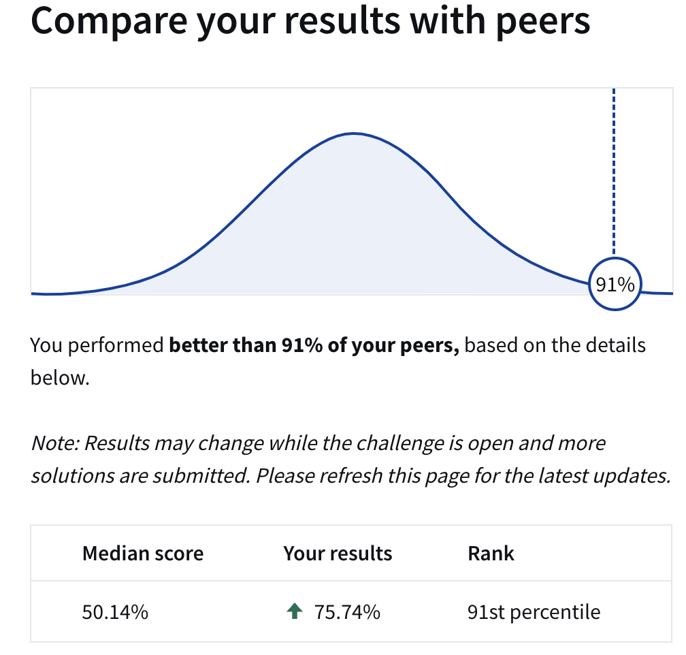

# Loan-Default-Prediction

Loan default prediction is an important issue for many banks and financial institutions, as significant losses can occur if borrowers default. This repository contains code for a data science challenge on Coursera aimed at predicting loan defaults using a real-world dataset. 

## Model Training Process

This section outlines the process for training a stacking ensemble model, which combines predictions from multiple base models using a meta-model. The base models include XGBoost, CatBoost, and LightGBM, and we utilize logistic regression as our meta-model. The following steps detail the model training and prediction process:

### 1. Hyperparameter Optimization for Base Models

- **Objective**: Optimize the hyperparameters of each base model (XGBoost, CatBoost, LightGBM) to achieve the best performance.
- **Data**: Use the `train.csv` dataset for training.
- **Methodology**: Employ Bayesian optimization to systematically search for the optimal set of parameters for each model. This method uses prior probability distributions of the parameters and updates them based on evaluation results.
  - Define a suitable range and distribution for each hyperparameter.
  - Set a maximum number of iterations or a stopping criterion to limit the search.
  - Use a validation set or cross-validation within this step to assess the performance of hyperparameters.

### 2. Training Base Models Using Cross-Validation

- **Objective**: Generate out-of-sample predicted default probabilities using the optimized base models.
- **Cross-Validation Setup**: Implement a k-fold cross-validation to ensure that each instance in the dataset is used for both training and validation. 
- **Procedure**:
  - **For Each Fold**:
    - Train each base model (XGBoost, CatBoost, LightGBM) on the training portion of the fold using the previously optimized hyperparameters.
    - Predict the default probabilities on the validation portion of the fold.
  - Compile the predictions from each model across all folds. These serve as the input features for the meta-model.

### 3. Training the Meta-Model

- **Objective**: Combine the predictions from the base models to compute the final predicted probabilities.
- **Model**: Use logistic regression as the meta-model, which is trained to optimally combine the base models' predictions.
- **Procedure**:
  - Use the compiled predictions from the base models as input features.
  - The target variable remains the actual outcomes from the dataset.
  - Train the logistic regression model on these features to learn how best to integrate the information from the base models.

## Evaluation metric
In the context of predicting loan defaults, traditional metrics like accuracy can be misleading because they may primarily reflect the majority class's prevalence rather than the model's ability to accurately identify defaults. The ROC AUC (Receiver Operating Characteristic Area Under the Curve) score is a more appropriate metric as it evaluates the model's performance across all classification thresholds, thereby providing a measure of effectiveness that is unaffected by the imbalance in the classes. 

<!-- Also, correctly identifying potential defaulters is crucial because failures to do so can lead to significant financial losses. Thus, the recall(true positive rate) is another important metric that we would like to optimize. -->

## Results Overview

This section provides a summary of the training process outcomes, including the optimal hyperparameters found for each base model, their respective performance metrics, and the performance of the final ensemble model.

### Optimal Hyperparameters

- **XGBoost**:
  - `eta`: 0.025827861209301896
  - `max_depth`: 3
  - `min_child_weight`: 0.0019473309150178314
  - `subsample`: 0.5934237482325593
  - `colsample_bytree`: 0.6504324929704666
  - `gamma`: 0.0001213481048730181
  - `lambda`: 0.02074451609900035
  - `alpha`: 0.018783933266092283
  
Best AUC:  0.7552089581383957

Best iteration:  836

- **CatBoost**:
  - `depth`: 3
  - `learning_rate`: 0.058
  - `l2_leaf_reg`: 3.13

Best AUC:  0.7551805065914452

Best iteration:  661

- **Random Forest**:
  - `n_estimators`: 900
  - `max_depth`: 15
  - `min_samples_split`: 2
  - `min_samples_leaf`: 10
  - `max_features`: 'sqrt'
  - `bootstrap`: True

### Performance Metrics

#### Base Model performance

After obtaining the optimal hyperparameters, the base models are trained on the whole training set and thier indepndent performances are given below

- **XGBoost**: 0.7604
- **CatBoost**: 0.7601
- **Random Forest**: 0.7565

#### Meta-Model Performance

- **Logistic Regression Meta-Model ROC AUC**: 0.7605

- **Summary**: The ensemble approach resulted in a only very slightly higher ROC AUC compared to any individual base model. This may not be statistically significant and may due to random error. Whether stacking generalization would help using the present base models may still require further study or other improvements are required. Future work could explore alternative meta-models or include additional base models to potentially improve the ensemble's predictive performance.

